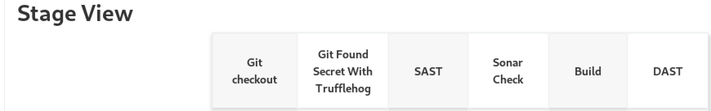
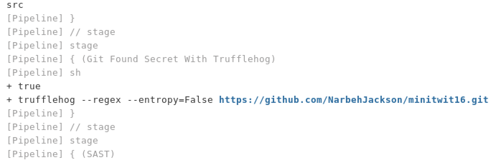
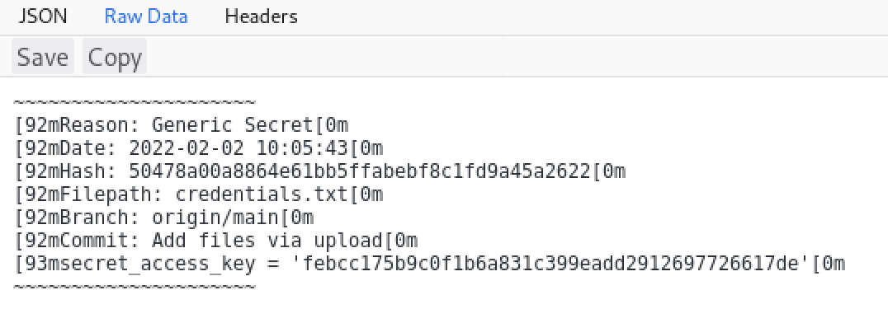
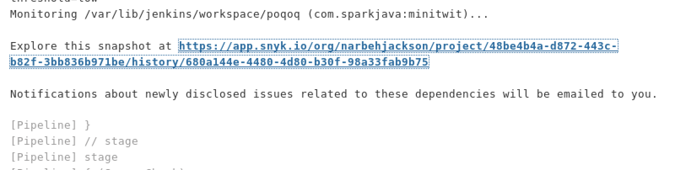
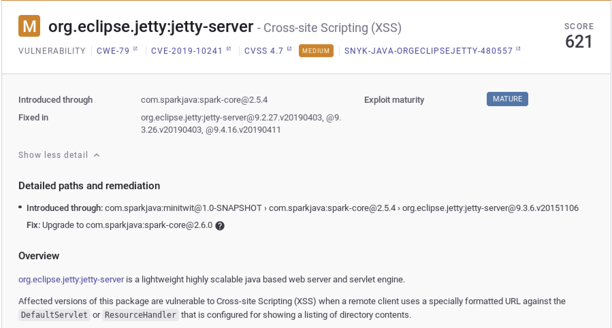
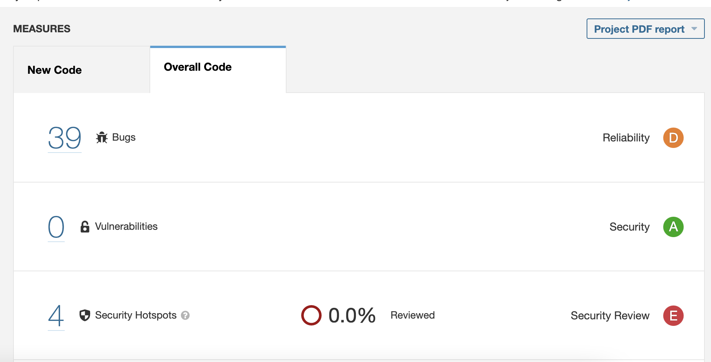
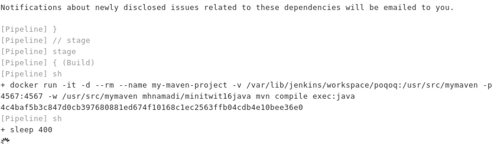
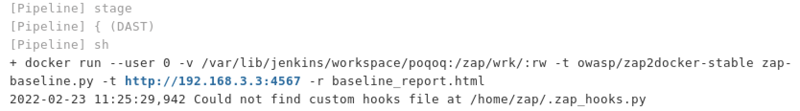
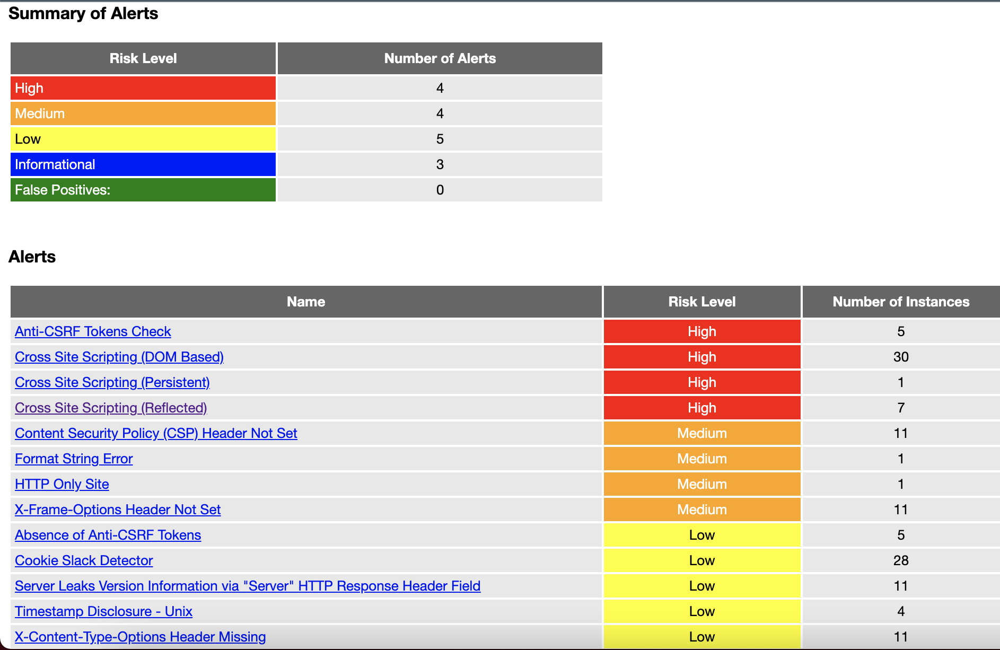

# DevSecOps-Java-1

## Requirments :  

Java Maven : https://maven.apache.org/

Trufflehog : https://github.com/trufflesecurity/truffleHog

Jenkins : https://www.jenkins.io/

Snyk : https://snyk.io/plans/

Sonarqube : SonarQube - An open-source web-based tool, extending its coverage to more than 20 languages, and also allows a number of plugins 

https://www.sonarqube.org/

OwaspZap : ZED Attack Proxy - It is an open source tool which is offered by OWASP for performing security testing

https://www.zaproxy.org/

## Sample DEVSECOPS Pipeline With Jenkins 

 

1 . Git Found Secret With Trufflehog (1 min)

     trufflehog --regex --entropy=False https://github.com/ NarbehJackson/minitwit16.git > 1.json | true

  Find Secret 

 

 

2. Snyk Team Plan (10 min)

           snykSecurity(
          	snykInstallation: 'Snyk',
          	snykTokenId: 'Snyk',
          	failOnIssues: 'false',
          	failOnError: 'false',			

If the failOnIssues is = true which means that when the code has a bug Pipeline doesn't continue

snykTokenId store on Jenkins Secret 

 

 

3. Sonar Developer Team Plan (10 min)

	     sh "mvn clean verify sonar:sonar && Dsonar.projectKey=test10 && Dsonar.host.url=https://yourdomain && Dsonar.login=c8ab9e42f9yourkeycec6bb852"

 

4. Build Process (15 min)

          sh "docker run -it -d --rm --name my-maven-project -v $WORKSPACE:/usr/src/mymaven -p 4567:4567 -w /usr/src/mymaven mhnamadi/minitwit16java mvn compile exec:java"

 

5. Owasp ZAP 	(20 min)

          sh "docker run --user 0 -v $WORKSPACE:/zap/wrk/:rw -t owasp/zap2docker-stable zap-baseline.py -t  http:// REMOTE Docker IP Or 127.0.0.1 :4567 -r baseline_report.html || true"

 

 

## Twitter & Facebook Contributor :
   
 https://www.linkedin.com/in/mohammad-hussein-namadi-775baa131/
 

                                	          \|||/                                               
                   .-.________               (o o)              ________.-.                    
              ----/ \_)_______)  +------------(_)-----------+  (_______(_/ \----               
                 (    ()___)     |          DevSecOps       |     (___()     )                  
                      ()__)      |                          |      (__()                        
              ----\___()_)       |	                         |       (_()___/----                
                                 +------------Ooo-----------+                                
                                                                                      

                                                                                 