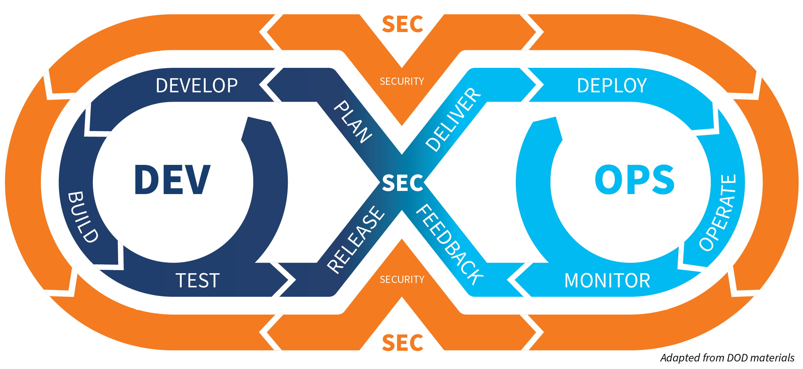
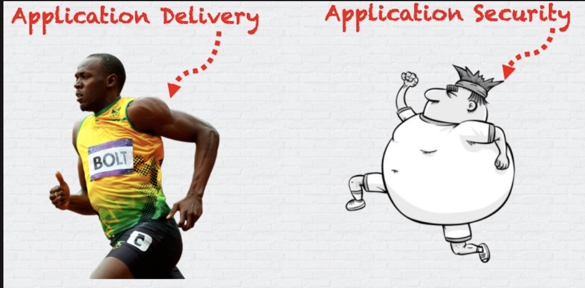

# DevSecOps

A laborator for learning SAST , DAST per language programming . 😆

In this lab we use SAST Tools & DAST Tools on Pipeline DevOps

## What is DevSecOps? bird’s eye view :))

DevSecOps, a relatively new term in the application security (AppSec) space, is about introducing security earlier in the software development life cycle (SDLC) by expanding the close collaboration between development and operations teams in the DevOps movement to include security teams as well. It requires a change in culture, process, and tools across the core functional teams comprising development, security, testing, and operations. 🚀

### Without DecSecOps ###

With the fostering of DevOps practices, development teams began delivering products faster and faster. This may have been one of the factors that led to increasing demands on the speed of product delivery, creating a circle of requests.

## SAST 

An application is only as secure as the source code it’s built on. That’s the philosophy behind Static Application Security Testing (SAST), which allows security engineers to identify threats to their apps at the source code level. This is the heart of Continuous Application Security

## DAST 

 DAST uses the opposite approach of SAST. Whereas SAST tools rely on white-box testing, DAST uses a black-box approach that assumes testers have no knowledge of the inner workings of the software being tested, and have to use the available inputs and outputs. Black-box testing needs to be dynamic. This is because as an application runs, the number of inputs and outputs increases and decreases, and the data they consume or release continuously changes. DAST tools therefore require that—at the very least—you have a working version of an app available for testing.

 

                                	         \|||/                                               
                   .-.________               (o o)              ________.-.                    
              ----/ \_)_______)  +------------(_)-----------+  (_______(_/ \----               
                 (    ()___)     |          DevSecOps       |     (___()     )                  
                      ()__)      |                          |      (__()                        
              ----\___()_)       |	                         |       (_()___/----                
                                 +------------Ooo-----------

 
